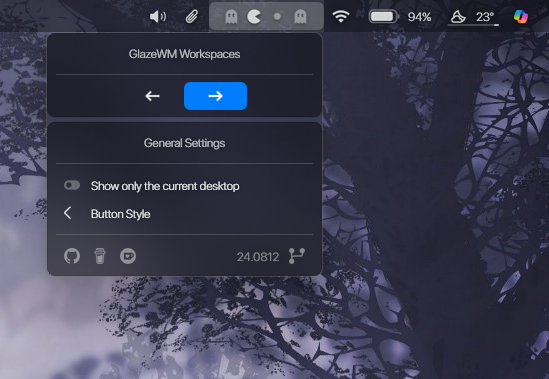

<h1 align="center">
  
   
  GlazeWM Workspaces - asrma7
   
</h1>

<h4 align="center">
GlazeWM Workspace Manager App for Droptop Four. Easy access to view and update your workspaces.
This app leverages the [GlazeWMWorkspacesPlugin](https://github.com/asrma7/GlazeWMWorkspacesPlugin), which I developed, to interface with GlazeWM's WebSocket.
</h4>

  <a href="#key-features">Key Features</a> •
  <a href="#upcoming-features">Upcoming Features</a> •
  <a href="#download">Download</a> •
  <a href="#credits">Credits</a> •
  <a href="#license">License</a>

  

## Key Features
- See active and current glazeWM Workspace.
- Move around GlazeWM workspace from the GUI.

## Upcoming Features
- Showing only the current desktop.

## Download
Download from [releases](https://github.com/asrma7/GlazeWM_Workspaces-asrma7/releases) or from the [website](https://droptopfour.com/community-apps/?id=86)

## Credits
- [VirtualDesktopAccessor](https://github.com/Ciantic/VirtualDesktopAccessor) dll file by [Jari Pennanen/Ciantic](https://github.com/Ciantic).
- [VirtualDesktop](https://github.com/KazukiGames82/VirtualDesktop-KazukiGames82) dll file by [Angel/KazukiGames82](https://github.com/KazukiGames82).
- Me.

## License
[GNU General Public License v3.0](LICENSE)

Feel free to modify or redistribute these Rainmeter skins as much as you want. Just:
- Link back to me somehow
- Use ths same license